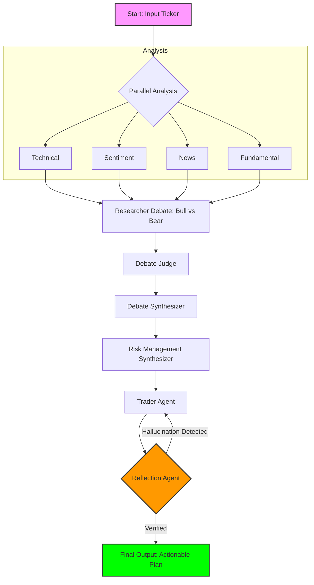

---

# AlphaForge

### Modular Multi-Agent AI Research & Trading Workflow

[](https://opensource.org/licenses/MIT)
[](https://www.python.org/downloads/)
[](https://devpost.com)

AlphaForge is a sophisticated multi-agent orchestration system designed for the Google Agent Development Kit Hackathon. It leverages the Agent Development Kit and Google Cloud to transform raw market data into explainable, automated financial decisions through a "Council of Agents" approach.

---

## Key Features

| Agent Type | Functionality |
| :--- | :--- |
| Parallel Analysts | Simultaneous Technical, Sentiment, News, and Fundamental data processing. |
| Debate Engine | LangGraph-powered simulation between Bullish and Bearish researchers. |
| Risk Synthesis | Tri-layer debate (Aggressive, Neutral, Safe) to determine optimal capital exposure. |
| The Trader | Final actionable decision-making (BUY/HOLD/SELL) based on synthesized logic. |
| Reflection Layer | Self-correcting feedback loop that audits decisions for hallucinations or errors. |

---

## Workflow Architecture



---

## Getting Started

### 1. Clone the Repository
```bash
git clone https://github.com/YOUR_USERNAME/AlphaForge.git
cd AlphaForge
```

### 2. Install Dependencies
```bash
pip install -r requirements.txt
```

### 3. Configuration
Create a .env file in the root directory and add your credentials:
```env
GOOGLE_CLOUD_PROJECT="your-project-id"
ADK_API_KEY="your-api-key"
```

---

## Usage

### Execute Workflow via CLI
Run the full automated pipeline for a specific ticker:
```bash
python Agents/workflow.py
```

### Launch Dashboard (UI)
Interact with the agents through a clean Streamlit interface:
```bash
streamlit run app.py
```

---

## Project Structure

```text
AlphaForge/
├── Agents/
│   ├── Researcher/      # Bull/Bear debate logic
│   ├── Analyst/         # Market data scrapers & processors
│   ├── Risk_Management/ # Strategy & safety synthesizers
│   ├── Trader/          # Decision execution logic
│   ├── Reflection/      # Verification & hallucination checks
│   ├── custom/          # Custom ADK tools
│   └── workflow.py      # Main orchestration entry point
├── app.py               # Streamlit UI
├── requirements.txt     # Dependency list
└── README.md            # Documentation
```

---

## Customization
- New Analysts: Easily plug in new data sources in the Agents/ directory.
- Logic Tuning: Modify the Risk_Management debate prompts to fit your profile.
- Scaling: Designed for easy deployment to Google Cloud Run or App Engine.

---

## License
This project is licensed under the MIT License.

---

**Built for the Google Agent Development Kit Hackathon.**
